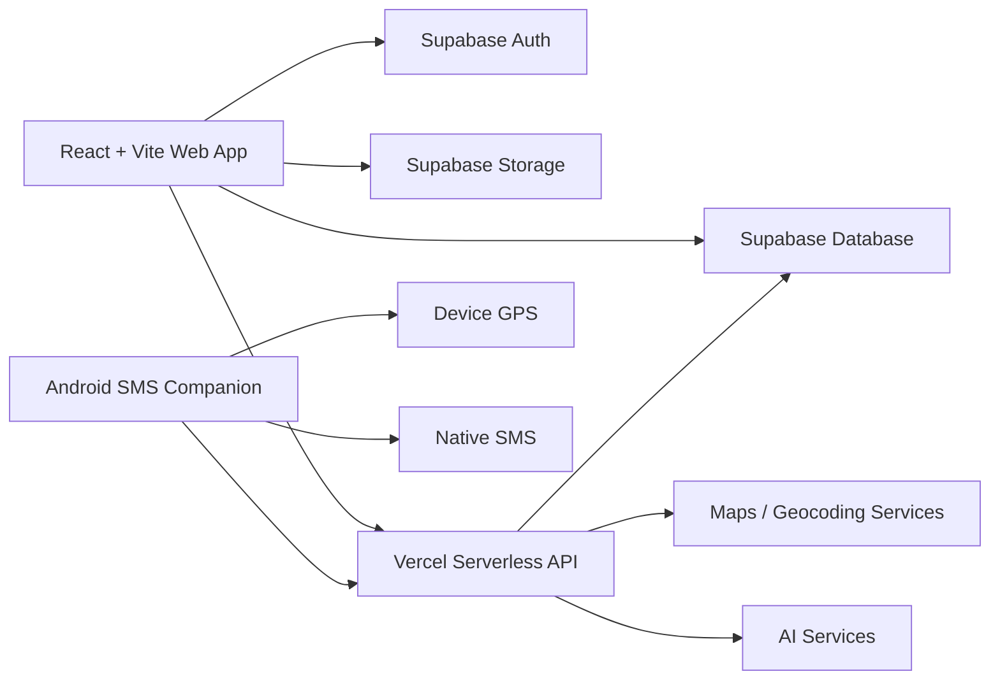

# SolarVisit

A full-stack field visit and appointment management platform for solar sales and technical teams.

SolarVisit was built to solve a real field-operations problem: organizing customer visits, reducing repetitive communication, improving route planning, and giving field engineers one place to manage the full appointment lifecycle.

## Why this project matters

Field teams often work across multiple tools for appointments, maps, customer notes, reminders, follow-up messages, and reporting. SolarVisit brings those workflows together into one application and automates the repetitive parts.

## Key Features

- Customer and appointment management
- Calendar-based visit planning
- Route optimization and geocoding
- Google Maps and Waze navigation links
- Automated appointment reminder workflows
- Thank-you SMS workflow after completed visits
- GPS-based arrival notifications
- Android companion application for SMS automation
- Customer status tracking
- Daily operational notes and summaries
- Reports and appointment statistics
- Offline customer cache support
- Supabase authentication, database, storage, and row-level security
- Responsive mobile-first React interface
- AI-assisted features for field workflows

## Architecture



The web application handles the main field workflow and user interface. Supabase provides authentication, persistent data, storage, and security policies. Vercel API routes handle server-side integrations and automation logic. The Android companion supports native SMS sending, device registration, background jobs, and GPS-based arrival workflows.

## Tech Stack

| Area | Technologies |
| --- | --- |
| Frontend | React 18, Vite, JavaScript, React Router |
| Backend | Vercel Serverless Functions |
| Database & Auth | Supabase |
| Mobile | Kotlin, Android, WorkManager |
| Location | Google Maps integrations, geocoding, route optimization |
| AI | Google GenAI integration |
| Deployment | Vercel |
| PWA | Vite PWA |

## Main Workflow

1. A field engineer creates or updates a customer appointment.
2. The appointment appears in the calendar and daily schedule.
3. Addresses can be geocoded and visits can be route-optimized.
4. Automated reminder jobs are created for upcoming appointments.
5. The Android companion can process approved SMS jobs.
6. GPS-based logic can notify customers when the engineer is approaching.
7. After a visit is completed, a follow-up / thank-you workflow can be triggered.
8. Reports and summaries provide visibility into field activity.

## Repository Structure

```text
solar-visit-planner/
├── api/                  # Vercel serverless endpoints
├── android/              # Public Android companion architecture notes
├── src/
│   ├── components/       # Reusable React UI
│   ├── hooks/            # Application hooks
│   ├── i18n/             # Greek / English translations
│   ├── pages/            # Main application screens
│   ├── server/           # Server environment helpers
│   ├── services/         # Supabase, SMS, route, AI and data services
│   ├── styles/           # Global application styling
│   └── utils/            # Shared utilities
├── supabase/             # Schema and database migrations
├── .env.example
├── vercel.json
└── vite.config.js
```

## Local Setup

Install dependencies:

```bash
npm install
```

Create a local environment file:

```bash
cp .env.example .env
```

Add your own development credentials to `.env`, then run:

```bash
npm run dev
```

Production build:

```bash
npm run build
```

## Environment Variables

The repository includes only placeholder values in `.env.example`.

Typical configuration includes:

- `VITE_SUPABASE_URL`
- `VITE_SUPABASE_ANON_KEY`
- `GOOGLE_MAPS_API_KEY`
- `TWO_GIS_API_KEY`
- `SUPABASE_URL`
- `SUPABASE_SERVICE_ROLE_KEY`
- `CRON_SECRET`
- `ANDROID_COMPANION_SECRET`

Server-only secrets must never be exposed to the browser.

## Security & Privacy

This is a sanitized portfolio version of the project.

- No production customer data is included.
- No production API keys or authentication secrets are included.
- No employer branding or employer-specific contact information is included.
- Production deployment URLs and Android device credentials are excluded.
- Android signing files and local configuration are ignored by Git.

The public Android folder intentionally documents the architecture without exposing production device configuration.

## What this project demonstrates

SolarVisit demonstrates practical full-stack engineering across:

- Business-process automation
- React application architecture
- Authentication and database design
- Serverless APIs
- Geolocation and route workflows
- Background Android jobs
- Native SMS integration
- AI-assisted application features
- Security-conscious environment configuration
- Real-world field-operations UX

## Status

Portfolio / demonstration version. Production-specific configuration has intentionally been removed.
